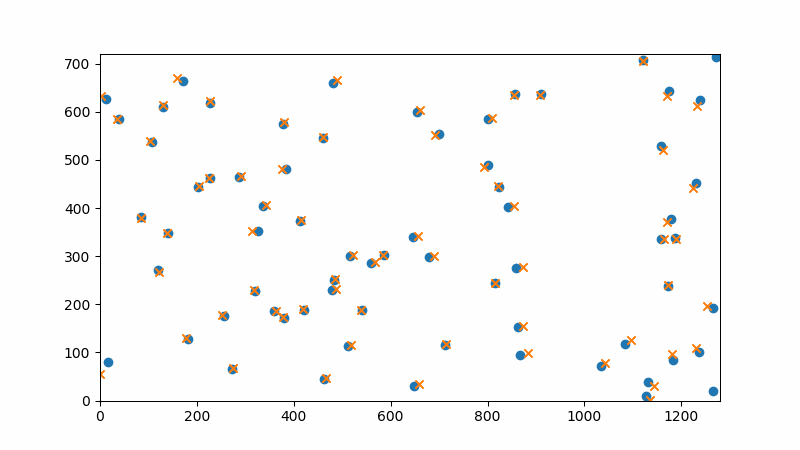

# Point Cloud Scanner

A crude attempt at a point cloud scanner

Project on hiatus
- Bundle adjustment works! (see attached gif or Images/Demo.gif)
	- (just needs good quality data with well labeled feature points and a good initial camera pose guess)
- Featurepoint recognition fails to recognise features well enough over successive frames
- Need better alternative to give bundle adjustment clean enough data